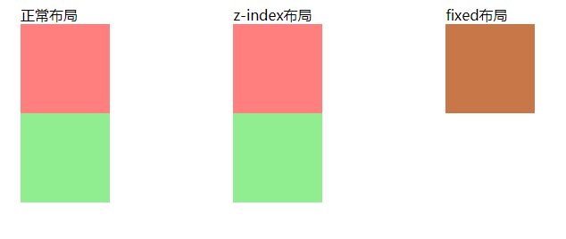

### css定位有哪些，区别是什么？

|属性值 | 描述 | 脱离文档流？| 是否可以使用top,left|
--|--|--|--|--
|static |默认值，默认位置没有定位|否|否|
|relative |相对于自身第一个位置定位|否|是|
|absolute |相对于离元素最近的设置了**绝对或相对定位**的父元素|是|是|
|fixed |对于浏览器窗口是固定位置|是|是|
|z-index | 元素的堆叠顺序|否|否|
|inherit | 从父元素继承 position 属性的值。|
|sticky | 实验阶段属性**不推荐** |

| 表头1     | 表头2    | 表头3    |
| :------------- | :-------------: | -------------: |
| 表格项1      | 表格项2      | 表格项3      |
| 给定一个参考项      | 可看出其对齐的内容     | 是否如实实现了各种对齐      |
| 有多行表格      | 参考依据     | 一目了然      |
---

### 如何判断是否脱离文档流？
- relative时,设置了left.但下方盒子并没有上移，说明上方盒子占据着位置。他们是同一个文档流。对比absolute布局

- z-index时,下方盒子并没有上移，说明上方盒子占据着位置。他们是同一个文档流，对比fixed布局

